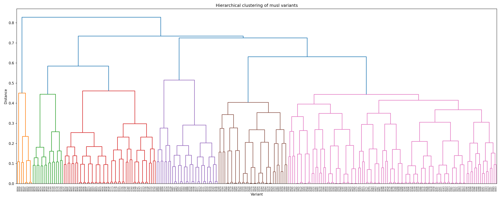
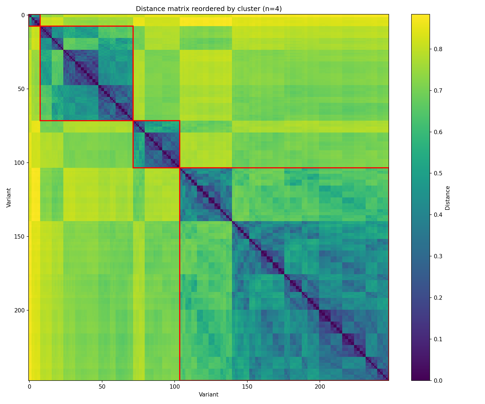

# Progress report — Step 1: musl variant generation via compiler flags

> Author: Romain CLEMENT  
> Date: 2026-06-07

## 1. Context and objective

This report presents the results of the first step of the project on
large-scale automatic generation of libc binary variants, whose final goal
is to produce up to 1 million variants by combining several
diversification axes (compiler flags, alternative libc implementations,
obfuscation).

This step 1 focuses on a single axis: generating variants of **musl libc**
by varying **GCC compilation flags** (optimization level, inlining, loop
unrolling, frame pointer, target architecture). The goal is twofold:

- measure how many genuinely distinct variants this single lever can
  produce ;
- validate the toolchain (generation, functional testing, deduplication,
  distance measurement, clustering) that will be reused in the following
  steps.

## 2. Method

### 2.1 Generation

A combinatorial grid of flags was built from 5 axes:

- optimization level: `-O0 -O1 -O2 -O3 -Os -Og`
- inlining: none, `-fno-inline`, `-fno-inline-functions`, `-finline-functions`
- loop unrolling: none, `-fno-unroll-loops`, `-funroll-loops`
- frame pointer: none, `-fno-omit-frame-pointer`
- target architecture: none, `-march=x86-64`, `-march=x86-64-v2`,
  `-march=x86-64-v3`, `-mtune=native`

Each combination is compiled into an independent `libc.so` variant, with a
SHA256 hash computed over both the full binary and the `.text` section
alone (executable code), in order to detect duplicates produced by
semantically equivalent flag combinations.

### 2.2 Functional validation

Each variant is tested with the `libc-test` suite, compared against a
reference musl toolchain built without any special flags (baseline). Each
variant's test failures are compared to the baseline's to distinguish an
actual regression from a pre-existing failure.

### 2.3 Diversity measurement

Variants remaining after deduplication are compared pairwise using
distances computed on extracted assembly mnemonics (`objdump`):

- Hamming distance (byte-wise)
- Jaccard distance (mnemonic n-grams)
- Levenshtein distance — **dropped**: quadratic per-pair complexity,
  already too costly beyond a few hundred variants.

Hierarchical clustering is then applied on the distance matrices to group
variants into families.

## 3. Results

### 3.1 Generation volume

| Metric | Value |
|---|---|
| Variants generated (flag combinations) | 720 |
| Distinct variants after deduplication (`.text` hash) | 248 |
| Duplication rate | ~65% |
| Total generation time | 65m45s |
| Parallelism used | 36 jobs |
| Average throughput | ~11 variants/minute (720 / 65m45s) |
| Compute server | Madagh (48 cores, 192 GB RAM) |

### 3.2 Functional validation

| Metric | Value |
|---|---|
| Baseline result (`libc-test`) | 6 pre-existing failures (see below) |
| Variants with regressions vs. baseline | 0 |
| Regression details | None — every variant's linear run reproduces exactly the same 6 failures as the baseline; no variant introduces an additional failure or fixes a baseline one |

Baseline failures (present in the reference toolchain and in every
variant, independently of the compilation flags used):

```
functional/strptime.exe
functional/tls_align.exe
functional/tls_align_dlopen.exe
functional/tls_init_dlopen.exe
math/fmal.exe
math/powf.exe
```

These are pre-existing musl/`libc-test` interactions unrelated to the
compilation flags studied here, not regressions introduced by this
experiment.

Test execution times:

| Run | Variants | Jobs | Wall-clock time |
|---|---|---|---|
| Linear (`21_test_campaign_linear.sh`) | 72 | 1 | 5m46s |
| Parallel (`22_test_campaign_parallel.sh`) | 72 | 24 | 8s |
| Parallel (`22_test_campaign_parallel.sh`) | 720 | 36 | 1m8s |

The 720-variant linear run was not executed (extrapolated cost too high
given the measured per-variant rate). Parallel execution gives a ~43x
speedup on the 72-variant sample (346s -> 8s), but see the concurrency
caveat below regarding result reliability.

### 3.3 Binary diversity





| Metric | Value |
|---|---|
| Metric used | Jaccard distance on 3-grams of assembly mnemonics |
| Number of clusters requested | 4 |
| Cluster size distribution | 1 very small cluster (~5-6 variants), one medium cluster (~65 variants), one small-medium cluster (~30 variants), one large cluster (~145 variants) |
| Inter-cluster distance | ~0.7-0.85 (clusters are cleanly separated) |
| Intra-cluster distance | mostly 0.0-0.3, except the largest cluster which is visibly more heterogeneous internally (up to ~0.5) |

Interpretation: the dendrogram shows the 248 distinct variants splitting
into a handful of clearly separated macro-families rather than a
continuum — inter-cluster distances (~0.7-0.85) are far higher than
intra-cluster distances, meaning the compiler flags do produce a few
genuinely distinct "shapes" of generated code.

Decoding the variant IDs against the flag grid (`11_build_campaign_grid.sh`
generates IDs in a deterministic nested order, which lets each ID be
mapped back to its exact flag combination) shows that the 4 clusters align
almost exactly with the **optimization level**, with two notable merges:

| Cluster | Size | Optimization level(s) |
|---|---|---|
| 1 | 8 | `-O0` only |
| 2 | 64 | `-O1` **and** `-Og` merged together |
| 3 | 32 | `-Os` only |
| 4 | 144 | `-O2` **and** `-O3` merged together |

The finer-grained flags (inlining mode, loop unrolling, frame pointer,
march/mtune) do not create any separation at this cluster level — the
optimization level alone drives the macro-structure of the diversity, and
two pairs of levels (`-O1`/`-Og`, `-O2`/`-O3`) are close enough to be
indistinguishable by this metric. This matches the expectation that musl's
codebase is too simple/small for `-O3` to exploit meaningfully more than
`-O2` (few hot loops to aggressively vectorize/unroll), and explains why
cluster 4 alone absorbs 144 of the 248 distinct variants (58%). This is
consistent with the low overall yield already observed after
deduplication (248/720) and supports the conclusion in Section 4 that
flag-driven diversity is reaching a ceiling.

## 4. Analysis and limitations

- **Parallel test runs are not reliable for correctness measurement.**
  Some `libc-test` binaries write to shared files, which causes
  concurrent-access failures when many tests run in parallel — these are
  false positives caused by the test harness, not genuine regressions in
  the tested variant. As a result, parallel test runs are only used here
  to measure throughput/speedup; any regression count reported in this
  document is based on the linear (single-job) run, which does not suffer
  from this race condition.
- The flag grid saturates quickly: about two thirds of combinations
  produce a binary strictly identical to another combination. This
  suggests many flags are either inert at certain optimization levels
  (e.g. unrolling has no effect below `-O2`) or redundant with each other.
- The Levenshtein distance, although implemented, is not usable as is: its
  quadratic per-pair cost becomes prohibitive at a few hundred variants,
  and would be completely out of reach at the scale targeted by the
  project (potentially millions of pairs).
- The "compiler flags" lever alone will not be enough to reach the
  project's diversity target; it must be combined with other axes
  (alternative libc implementations, obfuscation) to move past this
  ceiling.

## 5. Next steps

- Apply the same methodology to other libc implementations (glibc,
  llvm-libc) to assess whether a more complex codebase enables richer
  flag-driven diversity.
- Introduce generation methods orthogonal to flags, in particular code
  obfuscation (via tools like Tigress or OLLVM/clang) and fine-grained
  compiler-level randomization (register allocation seed, scheduling, NOP
  insertion), to move past the ceiling observed on this single axis.
- Replace/complement the distance measurement with approximate methods
  that scale better (e.g. minhash/LSH) ahead of the upcoming volume
  increase.
- Continue performance measurements (build time, test execution time,
  binary size) on the next generation axes to quantify the cost of each
  method.

