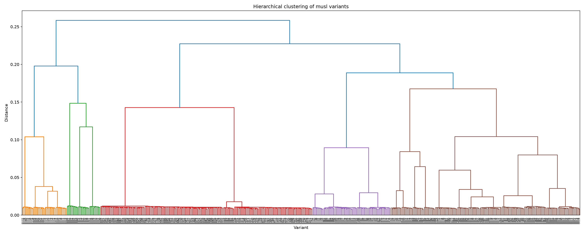
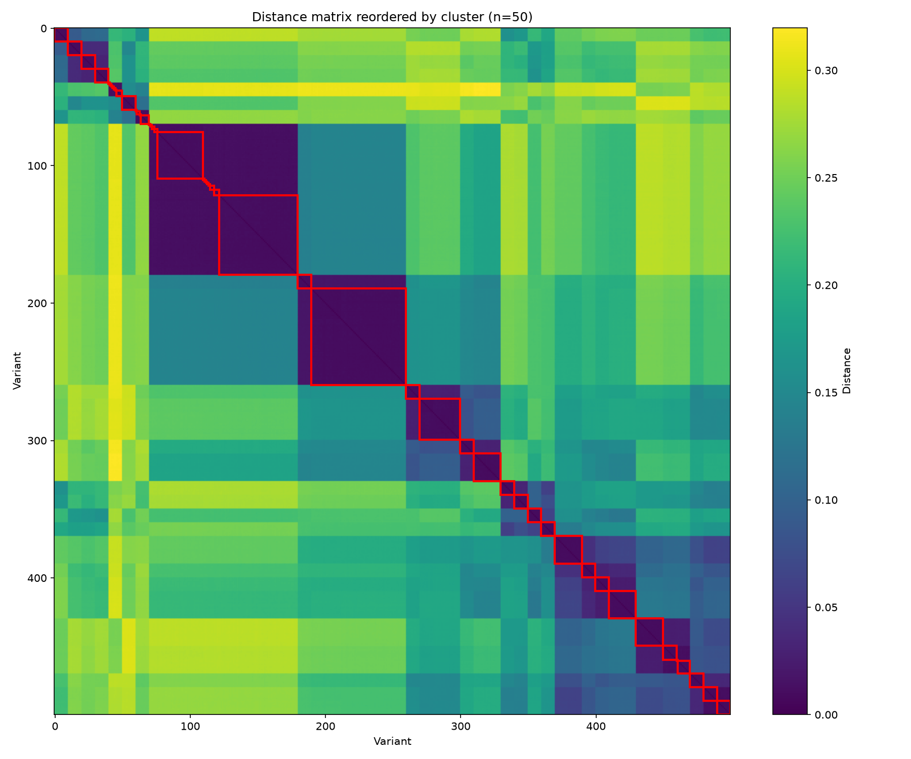

# Progress report — Step 2: musl layout randomization

> Author: Romain CLEMENT
> Date: 2026-07-30

## 1. Context

Step 1 showed that GCC compilation flags alone plateau fast as a diversity
source: 720 variants collapsed to 248 distinct ones (65% duplication), and
those 248 clustered almost entirely along the `-O` optimization level. Step 2
tests a different axis on the same musl codebase, with `-O2` fixed so the
measured diversity is attributable to this axis alone: **layout
randomization** — alignment jitter (`-falign-functions/-loops/-jumps/-labels`)
combined with a random function order and zero-filled padding gaps at link
time, driven by a per-variant seed.

To make this affordable at scale, generation is factored: variants are drawn
as `K` alignment combinations × `seeds_per_combo` seeds each, compiling musl
once per combination and reusing that compiled base to relink every seed of
that combination (only the link step, not the compile step, depends on the
seed).

## 2. Results

### 2.1 Generation volume and cost

| Metric | Value |
|---|---|
| Variants generated | 500 (50 alignment combos × 10 seeds) |
| Distinct variants after deduplication (`.text` hash) | 500 (0% duplication) |
| Generation time (factored pipeline) | 13m13s |
| Generation time (naive: full recompile per variant) | 53m17s |
| Speedup from factoring compile out of the per-seed cost | ~4x |
| Parallelism used | 36 jobs |
| Compute server | Madagh (48 cores, 192 GB RAM) |

Zero duplicates across all 500 variants — a stark contrast with step 1's 65%
duplication rate. This is expected in hindsight: two different flag
combinations can easily be no-ops of each other (e.g. an inlining flag with no
effect at a given `-O` level), producing byte-identical binaries. A different
seed reshuffles the order of several thousand `.text.*` sections and inserts
different padding gaps — the odds of two different seeds coincidentally
producing the same layout are negligible.

### 2.2 Functional validation

The first parallel test run flagged several variants as regressions, but a
targeted linear re-run of exactly those variants (avoiding the shared-file
race condition already documented in step 1) confirmed they all reproduce the
same 6 pre-existing baseline failures — **0 real regressions**, same as step
1.

### 2.3 Binary diversity

| Metric | Value |
|---|---|
| Metric used | Jaccard distance on 3-grams of assembly mnemonics |
| Variants compared | 500 |
| Pairs | 124,750 |
| Min distance | 0.0077 |
| Max distance | 0.3199 |
| Mean distance | 0.1904 |
| Std deviation | 0.0815 |

This range (0.008–0.32) is much narrower and lower than step 1's inter-cluster
distances (~0.7–0.85). That also makes sense: reordering functions and
padding between them only changes the mnemonic n-grams that straddle a
function boundary — the instructions *inside* each function are untouched,
so the bulk of the n-gram content stays identical across every variant
regardless of layout. Layout randomization produces diversity that is real,
but shallower per pair than a change of optimization level.

Clustering with `n_clusters=50` (matching the number of alignment
combinations) shows a strong structural correspondence between clusters and
combos — mirroring step 1's finding that clusters aligned with `-O` level:

- Most combos (18+ of the 50) form their own clean cluster of exactly their
  10 seed-variants: same combo, different seed, always closer to each other
  than to any other combo.
- Some combos collapse into a shared cluster regardless of seed: every combo
  with `align_functions=2` and `align_labels=64` (4 combos, differing only in
  `align_loops`/`align_jumps`) lands in the same 34-variant cluster — this
  particular pairing of alignment values dominates the layout so strongly
  that the other alignment axes and even the seed become nearly invisible to
  the metric.
- A couple of combos do the opposite: `align_labels=1` combined with a small
  `align_functions` (combos with these values) fragment into many singleton
  clusters instead of grouping — here the seed becomes the dominant factor
  instead of the alignment combo.

So alignment combo is generally the dominant structuring variable (like `-O`
level in step 1), with the seed contributing a smaller but consistent and
orthogonal layer of diversity inside each combo — except in a few corners of
the alignment parameter space where that relationship inverts.

## 3. What this means for the 1M-variant goal

- **Yield is effectively unlimited for this axis.** Step 1's flags grid hit a
  hard ceiling: only 248 distinct binaries out of 720 combinations, because
  the parameter space itself is small and full of redundant/inert
  combinations. Layout randomization has no such ceiling — the seed space is
  astronomically larger than the number of variants we'll ever generate, and
  every seed produces a distinct binary in practice (0/500 duplicates here).
  This axis alone can supply however many variants are needed, without
  running out of genuinely distinct outcomes.
- **But each individual variant is a shallower change than a flags-driven
  one.** The diversity is real (confirmed by clustering, confirmed
  functionally safe) but narrower in magnitude (max Jaccard distance 0.32 vs
  0.85) — this axis multiplies *volume*, not necessarily *depth*, of
  diversity.
- **The compile/link split is the key lever for reaching 1M.** The expensive
  part (compilation) scales with the number of *distinct alignment
  combinations*, not with the number of variants — the same 50 compiled bases
  here could each be relinked into thousands of seed-variants at a
  marginal cost of a few seconds per variant (just linking). This is the
  realistic path to generating variant counts several orders of magnitude
  above what full-recompilation approaches (step 1's model) could ever
  afford.
- **The practical implication for the overall project**: combine this axis
  with step 1's flags (and future axes) rather than relying on either alone —
  flags/obfuscation should provide the "depth" (real instruction-level
  changes), while seed-driven layout randomization provides near-free
  "volume" on top of any fixed flags/obfuscation choice. The alignment axis
  itself also isn't fully free of redundancy (the `functions=2`/`labels=64`
  collapse), so it's worth treating alignment combinations more like step 1's
  flags (subject to redundancy/pruning) while treating the seed as the
  genuinely unlimited, always-distinct dimension.
