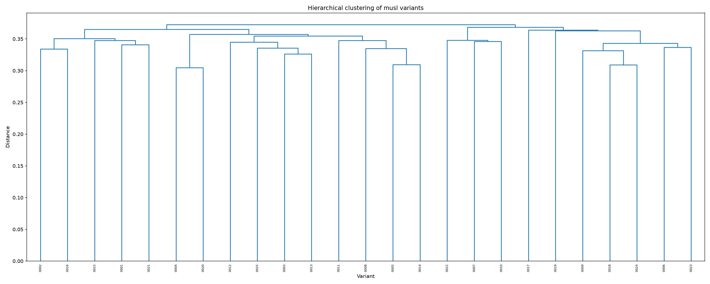
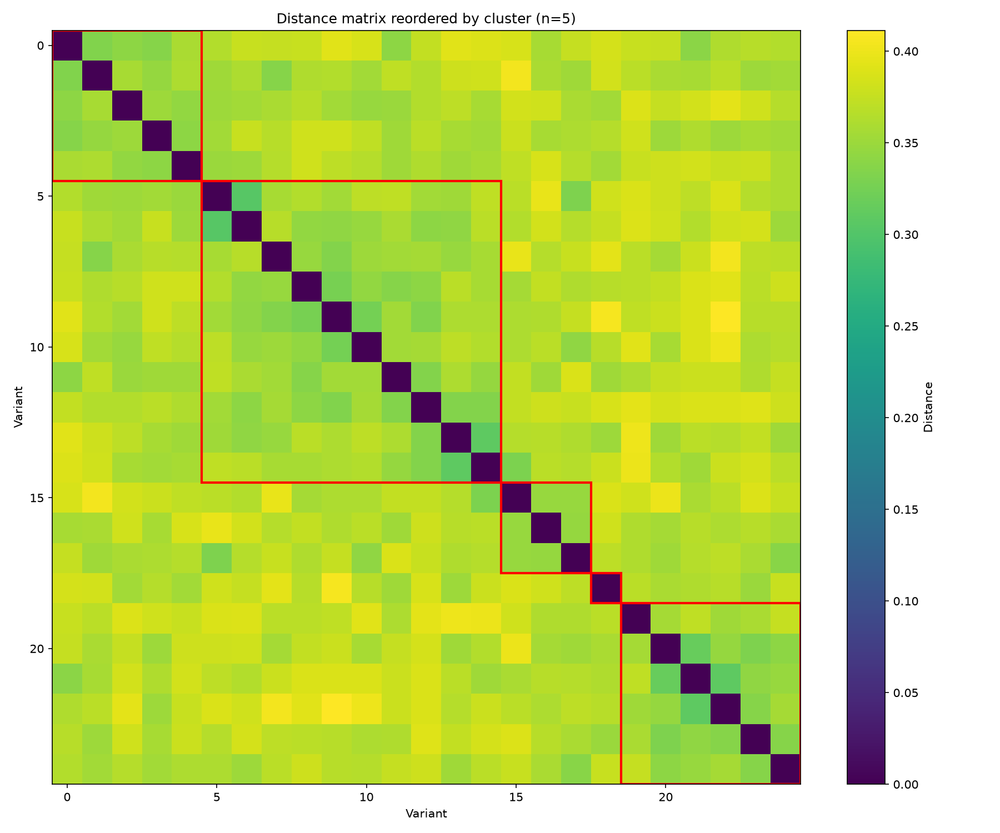

# Progress report — Step 3: musl obfuscation

> Author: Romain CLEMENT
> Date: 2026-08-24

## 1. Context

Steps 1 and 2 diversify musl through compiler flags and link-time layout
randomization, neither of which changes the actual shape of the compiled
code. Step 3 tests a third axis: **obfuscation** via Tigress, a
source-to-source C transform applied before compilation. See
`docs/step3_design.md` for the full justification of the tool, the
per-file architecture, and the specific transforms used — this report
covers results only.

The production pipeline assigns each eligible `.c` file in musl's corpus
one of 5 validated Tigress transforms (`Flatten`, `Split`, `Flatten,Split`,
`Copy`, `AntiTaintAnalysis`), independently and deterministically per
file, seeded per variant. **No layout relink**: an earlier design (K fixed
transform combos, each relinked many times via step 2's mechanism) was
found to attribute essentially all of its volume/duplication-avoidance to
step 2's relink, not to Tigress — see `docs/step3_design.md` §6 for the
full history. This design drops relink entirely to measure obfuscation's
own diversity contribution in isolation.

## 2. Results

### 2.1 Generation volume and cost

| Metric | Value |
|---|---|
| Variants generated | 25, each an independent full corpus compile with its own random per-file transform assignment |
| Distinct variants after deduplication (`.text` hash) | 25 (0% duplication) |
| Generation time (25 independent compiles, 4 parallel jobs, output cache warm-started from empty) | 56m22s wall-clock (real), 120m38s user, 68m16s sys |
| Compute server | Madagh (48 cores, 192 GB RAM) |
| Output cache hit rate (this run) | 73.7% (22,094 / 29,971 per-file obfuscation requests served from cache instead of recomputed) |

Zero duplicates across all 25 variants, matching every prior axis and
architecture tested in this project.

Obfuscation coverage per variant (musl's own build selects ~1,375
eligible `.c` files for this target; a file falls back to unobfuscated
compilation if any pipeline stage fails on it, see `docs/step3_design.md`
§4): **1,193–1,202 files obfuscated per variant (mean ~1,199, ~87.2%
coverage)** — consistent and narrow across all 25 variants, essentially
unaffected by which specific per-file assignment was drawn.

The per-file transform assignment is close to perfectly uniform in
aggregate, across all 25 variants combined (29,971 total obfuscation
requests):

| Transform | Total files assigned | Share |
|---|---|---|
| `Copy` | 6,087 | 20.3% |
| `Flatten,Split` | 6,062 | 20.2% |
| `Flatten` | 6,027 | 20.1% |
| `Split` | 5,916 | 19.7% |
| `AntiTaintAnalysis` | 5,879 | 19.6% |

No systematic bias toward any one transform — the deterministic
hash-based assignment (§`docs/step3_design.md` §6) behaves as intended.

### 2.2 Functional validation

| Metric | Value |
|---|---|
| Baseline result (`libc-test`, unobfuscated musl) | 334/340 pass — 6 pre-existing failures, same reference used throughout this project |
| Range across all 25 variants | 324–327 pass (13–16 failures) |
| Mean across all 25 variants | 325.7 pass (14.3 failures) |

Obfuscation adds roughly 7–10 additional failures on top of the 6
pre-existing baseline ones. This range is **narrower** than the earlier
K-combo design's per-combo spread (322–327, 13–18 failures) — expected,
since every variant here mixes all 5 transforms in similar proportions
instead of one variant being "pure `Flatten`" (that combo's weakest
performer) and another "pure `AntiTaintAnalysis`" (its strongest). Mixing
per file averages out each transform's own failure modes within every
single variant rather than concentrating them in a handful of
whole-corpus builds.

The additional failures are not new or unexplained: they fall into the
same categories already triaged during this axis's feasibility testing —
a cluster of TLS/thread-bootstrap tests sensitive to timing around the
constructor-based fix needed to make Tigress-generated code initialize
correctly (see `docs/step3_design.md` §4), a cluster of
out-of-memory-pattern tests, and a small number of environment-sensitive
tests unrelated to obfuscation.

### 2.3 Binary diversity

| Metric | Value |
|---|---|
| Metric used | Jaccard distance on 3-grams of assembly mnemonics |
| Variants compared | 25 |
| Pairs | 300 |
| Min distance | 0.3048 |
| Max distance | 0.4114 |
| Mean distance | 0.3649 |
| Std deviation | 0.0173 |

This is the core result this redesign set out to test, and it confirms
the hypothesis cleanly: **the earlier K-combo design produced 5 discrete
"islands" of diversity (mean 0.38, std 0.23, distances ranging from 0.008
to 0.59 depending on which two combos were compared); this design
produces a tight, near-uniform continuum instead (std 0.017 — more than
13× tighter, with every single pairwise distance falling in a narrow
0.30–0.41 band regardless of which two variants are compared)**.

The reordered heatmap shows this directly: the earlier K-combo version had
sharp, visually obvious dark diagonal blocks (near-zero within-combo
distance) against a bright, clearly different off-diagonal (0.4–0.6,
between-combo distance) — clusters were unmistakable by eye. Here, the
`n_clusters=5` boundaries are still drawn (red lines) but are **not
visually distinguishable by color from the rest of the matrix** — the
whole matrix is a near-uniform yellow-green. The dendrogram makes the same
point even more starkly: in the K-combo version, leaf-level merges
happened at ~0.01–0.02 while the top-level splits happened at ~0.44–0.55,
a >20× gap that is the signature of genuinely separate families. Here,
**every merge in the entire tree — from the closest pair of variants to
the single highest join at the top — falls within the same narrow
0.30–0.37 band.** There is no meaningful hierarchical structure left to
find: forcing a cut into 5 clusters (matching the old design's transform
count, for comparability) produces a partition, but not a *meaningful*
one — cluster sizes (5, 10, 3, 6, 1) look arbitrary because they are:
cutting a genuinely flat, structureless distance cloud at any `n_clusters`
value would produce comparably arbitrary groupings.

## 3. Analysis and limitations

- **The redesign achieved exactly what it set out to: obfuscation's own
  diversity is now a real continuum, not 5 discrete points.** The
  previous report's core finding — Tigress contributed only 5
  interchangeable "shapes" while step 2's relink supplied all the actual
  variant-to-variant volume — is superseded by this result. Assigning
  transforms per file instead of per whole-corpus-build turns that same
  set of 5 validated transforms (§`docs/step3_design.md` §5, unchanged)
  into a genuine combinatorial diversity source, with **no new Tigress
  research needed** — only the assignment granularity changed.
- **The 0%-duplication, 25-variant result is no longer borrowed from step
  2.** Unlike the previous design, no relink step runs here at all —
  every bit of measured diversity in §2.3 is attributable to obfuscation
  alone. This directly answers the question the previous report's
  analysis section raised: obfuscation *can* supply its own volume, once
  the assignment granularity is fine enough.
- **This came at a real, deliberately-accepted compute cost.** Dropping
  relink means every variant is again a full corpus compile — this
  campaign (25 variants) took 56 minutes wall-clock even with the output
  cache warm-starting from empty and reaching a 73.7% hit rate along the
  way. The cache bounds the campaign's *unique* Tigress work at roughly
  "5 full corpus passes, ever," regardless of how large N grows — so this
  cost should scale much better for larger campaigns than the raw
  per-variant time suggests, but it will never be as cheap as step 2's
  relink-only volume (a few seconds per variant). See
  `docs/step3_design.md` §6 for the caching mechanism and why it's
  correctness-safe.
- **Functional cost is real but bounded and already-understood**, not a
  new set of bugs: 13–16 residual failures per variant beyond the 6
  pre-existing baseline ones, all falling into categories already triaged
  during earlier feasibility work (TLS/bootstrap timing, out-of-memory
  patterns, a handful of environment-sensitive tests) — not chased to
  zero, consistent with this project's approach on the two previous axes.
- **Obfuscation coverage tops out around 87%, not 100%, for a structural
  reason, not a bug.** `memcpy`/`memset`/`memmove` and other hot-path
  string functions are hand-written x86-64 assembly on this architecture
  — a source-to-source C obfuscator has no access to them, a permanent
  gap for this axis (see `docs/step3_design.md` §7).
- **`Copy` still widens the exported symbol surface** (its duplicated
  helper functions are not marked hidden) wherever it's assigned to a
  file — a cleanliness gap noted in `docs/step3_design.md` §7, not a
  correctness issue.

## 4. Next steps

- This is now the load-bearing generation mechanism for step 3's
  obfuscation axis. Combining it with steps 1 and 2 (compiler flags,
  layout randomization) is step 4's scope — worth deciding explicitly
  there whether to layer step 2's relink back on top of a fixed
  per-file-assignment base for additional cheap volume once obfuscation's
  own diversity has been captured, now that both mechanisms are
  independently validated and quantified.
- A handful of transforms remain unexplored for lack of supporting
  wrapper infrastructure rather than because they were shown unsafe:
  `EncodeData` (needs a variable-list extraction step), `RandomizeArgs`
  (needs a public-ABI-safe function filter), `AntiAliasAnalysis` (needs a
  more thorough constructor-rename fix). Adding any of them to the
  5-transform pool would directly widen the combinatorial space this
  design already exploits.
- Close the `Copy`-transform symbol-visibility gap (§3) before treating
  this pipeline as production-final.
- The `sys` time on this campaign (68m16s, exceeding `user` time on a
  wall-clock-normalized basis) stood out but wasn't investigated further
  — worth profiling if throughput becomes a priority for step 4's larger
  target volumes.
