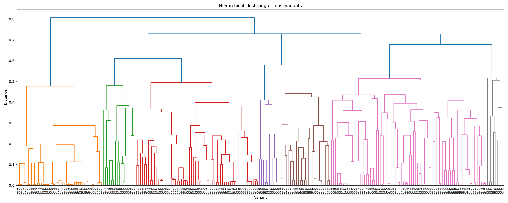
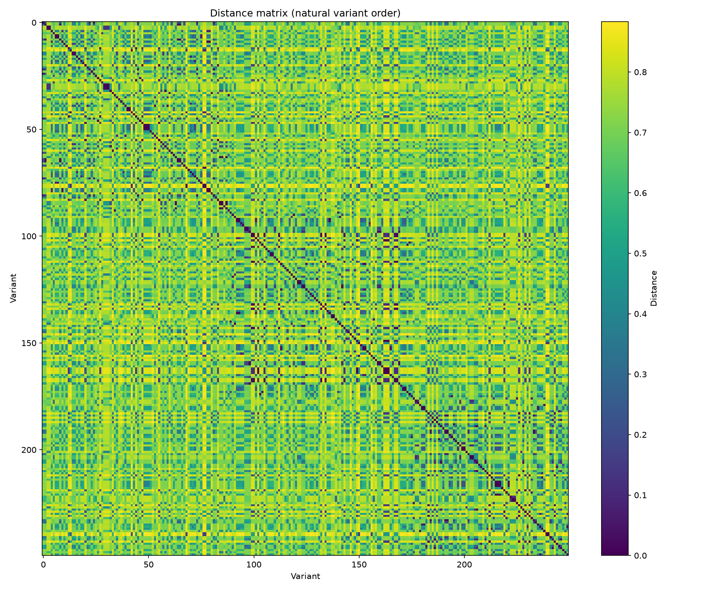

# Progress report — Step 4: axis combination (flags + layout + obfuscation)

> Author: Romain CLEMENT
> Date: 2026-08-25 (draft, pending final scale-up + local-storage retest)

## 1. Context

Steps 1-3 each diversified musl through a single axis in isolation:
compiler flags, link-time layout randomization, and Tigress obfuscation.
Step 4 combines all three into one pipeline instead of generating each
separately, and adds throughput optimization work toward the project's
"1 million variants" target.

Combining axes naively is expensive: crossing step 1's full 720-combo flag
grid against Tigress (by far the slowest axis, a real per-file
source-to-source transform) would mean up to 720 separate obfuscation
passes. The architecture instead uses a three-tier pipeline, cheapest tier
last, so the expensive axis is repeated the fewest times:

1. **Obfuscate once per Tigress assignment seed** (`17_build_source_tigress.sh`)
   — reuses step 3's per-file mixed-transform assignment mechanism, but
   persists the result as a *source* tree instead of compiling it, so the
   same obfuscated corpus can be recompiled with many different flag
   combos without rerunning Tigress.
2. **Compile with a flags combo** (`18_build_base_step4.sh`) — as cheap as
   step 1's own builds, since no Tigress runs here at all.
3. **Relink with layout randomization** (`13_build_variant_random.sh`,
   reused unchanged from step 2) — near-free, several relink seeds per
   compiled base.

**Flags source**: a fixed number of flag combos (`flags_combos`, default
250) drawn independently at random from step 1's 5 axes (optimization
level, inlining, unrolling, frame pointer, march/mtune) — the same
fixed-N sampling pattern steps 2 and 3 already use, rather than
enumerating step 1's full 720-combo grid or depending on step 1's own
scripts/results in any way. Step 1 itself is not touched by step 4.
Deliberately not pre-filtered by step 1's own plain-musl duplication
numbers (65% of the full grid collapses to identical `.text`) — that
number was measured without obfuscation in the mix, and whether it
transfers to Tigress-obfuscated source is unverified, so step 4's own
deduplication pass measures the real rate directly instead of assuming it.

**Throughput optimizations**, layered on top of the base architecture
once it was working correctly:
- A shared Tigress *prep* cache (reference-compile + preprocess +
  stub-main, seed-independent work) across every seed in a campaign,
  instead of redone from scratch per seed.
- Hardlinking (`cp -al`) the per-combo base tree copy instead of a real
  recursive copy of musl's ~2600-file source tree, since tier 2 runs
  hundreds of times per campaign.
- Removing a hard barrier between tiers: the first design waited for
  *every* Tigress seed to finish before starting *any* tier 2/3 work; the
  current design dispatches each seed's own tier 2/3 combos as soon as
  that seed's obfuscation finishes, without waiting on the others.

## 2. Results

### 2.1 Generation volume and cost

| Metric | Value |
|---|---|
| Variants generated | 3750 (3 Tigress seeds × 250 flag combos × 5 relink seeds) |
| Distinct variants after deduplication (`.text` hash) | 3750 (0% duplication) |
| Generation time, before throughput optimizations | `real 186m13.266s`, `user 1250m34.495s`, `sys 532m35.731s` |
| Generation time, after throughput optimizations | `real 164m58.368s`, `user 1213m22.657s`, `sys 516m37.976s` |
| Wall-clock improvement | **-11.4%** (~21 min saved) |
| CPU-time improvement (user, sys) | -3.0%, -3.0% |
| Effective parallelism, (user+sys)/real | 9.58x → 10.49x |
| Compute server | Madagh (48 cores, 192 GB RAM) |

Zero duplicates across all 3750 variants, matching every prior axis and
architecture tested in this project (steps 2 and 3 both also measured 0%
duplication once relink/per-file obfuscation seeding was involved).

The throughput gain is real but modest, and the composition of the
improvement is informative: wall-clock time improved substantially more
(-11.4%) than total CPU-seconds (-3.0%), consistent with the three fixes
mainly improving *overlap* (barrier removal, cache sharing) rather than
cutting the fundamental compute volume — Tigress obfuscation and
compilation are genuinely CPU-bound work that these fixes don't shrink.
`sys` time barely moved despite the hardlink fix specifically targeting
`cp -r`'s I/O cost, which led to a separate discovery: **Madagh's home
directory is NFS-mounted**, not local storage — confirmed via `df -T`.
This means the elevated `sys` time (relative to `user`, ~43% before
optimization) is very likely dominated by NFS RPC overhead rather than
local disk I/O, which the hardlink fix can reduce (metadata operations are
still cheaper over NFS than a full data copy) but not eliminate. Testing
generation from local (non-NFS) storage instead — either just `tmp/`, or
the whole working copy including `deps/musl` (needed for the hardlink
optimization to actually engage, since hardlinks cannot cross filesystem
boundaries) — is the next throughput lever, not yet measured.

### 2.2 Functional validation

| Metric | Value |
|---|---|
| Variants tested | 3750 |
| Pass count per variant (out of 340) | min 313, max 326, mean 322.88, std 3.80 |
| Variants with an ELF-format or required-ABI-symbol failure | 0 / 3750 |
| Distinct failing test executables across the campaign | 30 |

No variant had a broken ELF or missing required ABI symbol — the
combined pipeline (obfuscation + arbitrary compiler flags + layout
relink) never produces a structurally broken `libc.so`. Cross-referencing
failure frequency against how many of the 3750 variants each individual
`libc-test` executable fails in surfaces four distinct patterns:

- **14 tests fail in 100% of variants**: the same pre-existing baseline
  failures already documented in steps 1-3 (the OOM regression cluster,
  the TLS cluster, and known environment-sensitive tests like `fscanf`,
  `fdopen`, `strptime`, `powf`, `fmal`). Not a step 4 regression.
- **`vfork.exe` (66.7%) and `execle-env.exe` (33.3%) fail in exact
  multiples of one Tigress seed's variant count** (1250 = 250 flags × 5
  relinks). This is a new finding at step 4's scale: since each file's
  Tigress transform assignment is a deterministic function of
  `(seed, file path)`, this pattern means a specific seed's assignment
  gives an incompatible transform to a fork/exec-critical file, breaking
  every variant built from that seed regardless of flags or relink. Not
  yet root-caused (which file, which transform) — deferred, not blocking.
- **9 transcendental math functions** (`yn`, `y1`, `y0`, `log2`, `log`,
  `lgamma_r`, `lgamma`, `asinh`, `acosh`) **fail in exactly 20% of
  variants** — 1/5, matching the number of possible `march`/`mtune`
  values in the flags grid. Plausibly one specific value (most likely
  `-mtune=native`, the only machine-dependent one) causes small rounding
  differences that trip these tests' strict precision checks — likely
  benign codegen-driven ULP variance rather than a real correctness bug,
  not yet confirmed.
- **`spawn.exe` (30.4%)** doesn't match either pattern cleanly — not yet
  explained.
- **4 tests fail in under 1% of variants** (`ipc_msg`, `ipc_shm`,
  `ipc_sem`, `pthread_cancel-points`): consistent with the parallel
  test-runner shared-file race condition already documented in step 1's
  own report, not a real per-variant difference.

### 2.3 Binary diversity

Pairwise comparison across all 3750 variants is computationally
infeasible (`32_jaccard_distances.py` ran out of memory) — the README's
own guidance already caps this method at "a few hundred" variants. A
uniform random sample of 250 variants was used instead (script gained a
`sample_size` parameter for this).

| Metric | Value |
|---|---|
| Metric used | Jaccard distance on 3-grams of assembly mnemonics |
| Variants sampled | 250 (of 3750) |
| Pairs | 31,125 |
| Min distance | 0.0038 |
| Max distance | 0.8837 |
| Mean distance | 0.6786 |
| Std deviation | 0.1626 |

Mean distance (0.68) is well above step 3's own per-file mixed-assignment
continuum alone (mean 0.36, N=25) and close to step 1's inter-cluster
separation by optimization level (0.7-0.85) — combining axes measurably
amplifies diversity beyond what any single axis produced on its own.

The dendrogram shows a real hierarchy (merge heights spanning ~0 to ~0.8
across several distinct branches) and the plain heatmap shows a clear
grid/checkerboard pattern — both are the signature of a genuine
categorical driver, unlike step 3 alone's near-uniform continuum
(std 0.017). Clustering with `n_clusters=4` and cross-referencing cluster
membership against each variant's actual flag combo (a new helper,
`analyze_step4_clusters.py`) shows this structure is driven almost
entirely by **optimization level**, and reproduces step 1's own original
finding exactly:

| Cluster | Size | Optimization level(s) |
|---|---|---|
| 1 | 44 | `-O0` only |
| 2 | 80 | `-O1` (47) and `-Og` (33) merged |
| 3 | 37 | `-Os` only |
| 4 | 89 | `-O2` (45) and `-O3` (44) merged |

The same two merges step 1 found (`-O1`≈`-Og`, `-O2`≈`-O3`) reappear
here, and every other flags axis (inlining, unrolling, frame pointer,
march/mtune) is spread near-evenly across all 4 clusters with no
separation — matching step 1's "finer flags don't create separation at
this level" finding precisely. Obfuscation and layout relink don't
override or disrupt this flags-driven macro-structure; they add the
finer within-cluster variation instead, consistent with `std=0.16` being
real structure but not as sharply separated as step 1's own numbers
(0.7-0.85 between clusters), since obfuscation/relink noise sits on top.

## 3. Analysis and limitations

- **Deduplication is measured directly, not assumed from step 1.** Step 1's
  65% duplication rate on plain musl does not automatically apply to
  Tigress-obfuscated source, and this design deliberately doesn't assume
  it does — the 0% duplication measured here is step 4's own real result,
  on its own (obfuscated) output.
- **`vfork.exe`/`execle-env.exe`'s seed-correlated failures are a genuine,
  new-at-this-scale finding**, not present in step 3's own N=25 campaign
  (either because the specific bad (seed, file, transform) combination is
  rare enough that N=25 didn't happen to include an affected seed, or
  because step 3's smaller scale never made the pattern statistically
  visible). Worth root-causing before this pipeline is treated as
  production-ready — pinning down which file and transform is
  responsible is the natural next step if pursued.
- **The math-function/march sensitivity and `spawn.exe`'s failure rate are
  both unconfirmed leads**, not verified beyond the frequency pattern
  itself.
- **NFS discovery changes the throughput story**: the -11.4% wall-clock
  gain from the three code-level optimizations is real, but a
  meaningfully larger gain is plausible from moving off NFS-mounted
  storage entirely, not yet measured.
- Coverage caveat inherited from step 3 unchanged: `memcpy`/`memset`/
  `memmove` (pure x86_64 assembly) can never be source-level obfuscated by
  this pipeline.

## 4. What this means for the 1M-variant goal

- **Combining axes is a real, measured diversity win, not just additive.**
  Mean pairwise distance (0.68) exceeds any single axis measured alone in
  this project so far, and the clustering result shows the axes compose
  cleanly: flags (optimization level specifically) drive the macro
  structure, obfuscation and layout relink add real variation without
  erasing it.
- **The compile/relink split remains the key volume lever, same as step 2's
  own conclusion.** The expensive step (Tigress obfuscation) scales with
  the number of *seeds*, not variants — 3 seeds produced the entire
  3750-variant campaign here. Scaling `relink_seeds_per_base` (near-free)
  and `flags_combos` (cheap, no Tigress) is far more affordable than
  scaling `tigress_seeds`.
- **Throughput still has real headroom before scaling further.** The NFS
  discovery suggests the current ~165-minute campaign time is not yet
  compute-bound in the way it appears — testing local storage is the
  natural next step before committing to a much larger run, since it
  could change the realistic ceiling for how far this pipeline can scale
  within a given time/compute budget.

*(This report is a draft — pending: local-storage retest results, and
final parameters for the scaled-up campaign toward the project's 1M
target.)*
